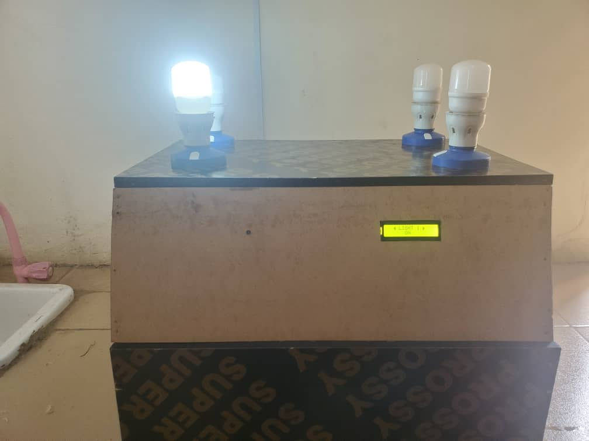

# Gesture-Controlled IoT Lighting System

A simple yet effective IoT project that allows users to control home lighting using hand gestures, captured via a webcam. This project was developed as part of my final year coursework at Ajayi Crowther University.

## 📸 Project Showcase

Here are some pictures of the completed project, from the circuit construction to the final working system.

### Final Assembled Project
*This image shows the complete setup with the lamp, sensor, and microcontroller.*



---

## 🚀 What The Project Does

This system eliminates the need for physical switches by using computer vision to recognize hand gestures. It can:
* Turn a light ON or OFF.
* Provide real-time feedback based on the gesture it recognizes.

---

## 🛠️ Technologies Used

### Hardware
* **Microcontroller:** Arduino Nano
* **Sensor:** IR Sensor (or Ultrasonic Sensor, specify which you used)
* **Actuator:** 5V Relay Module
* **Lighting:** A standard LED or a small lamp
* **Other:** Breadboard and Jumper Wires

### Software & Libraries
* **Language:** Python 3.8+ & C++ (for Arduino)
* **Core Libraries:**
    * `OpenCV` - For capturing webcam feed and computer vision.
    * `pySerial` - To facilitate communication between the Python script and the Arduino.
* **Development Environment:** Arduino IDE, VS Code

---

## ⚙️ How to Set Up and Run It

### 1. Hardware Setup
1.  Connect the components according to the circuit diagram (Pro-tip: add a picture of your circuit diagram to the repository and link it here!).
2.  **Arduino Connections:**
    * Connect the Sensor's `VCC` pin to `5V` on the Arduino.
    * Connect the Sensor's `GND` pin to `GND` on the Arduino.
    * Connect the Sensor's `OUT` pin to digital pin `D2` on the Arduino.
    * Connect the Relay Module's `IN` pin to digital pin `D4` on the Arduino.
3.  Connect the lamp to the relay module according to the relay's specifications.

### 2. Software Setup
1.  **Clone the repository:**
    ```bash
    git clone [https://github.com/YourUsername/Gesture-Control-Lighting-System.git](https://github.com/YourUsername/Gesture-Control-Lighting-System.git)
    cd Gesture-Control-Lighting-System
    ```
2.  **Install Python dependencies:**
    ```bash
    pip install opencv-python pyserial
    ```
3.  **Upload the firmware to the Arduino:**
    * Open the `/firmware` folder.
    * Open the `firmware.ino` file in the Arduino IDE.
    * Select your board (Arduino Nano) and the correct COM Port.
    * Click the "Upload" button.

### 3. Running the System
1.  Ensure the Arduino is connected to your computer via USB.
2.  Make sure your webcam is connected and not being used by another application (like Zoom or Teams).
3.  Run the main Python script from your terminal:
    ```bash
    python main.py
    ```
4.  A window showing your webcam feed should appear. Position yourself in front of the camera and use the pre-defined gestures to control the light.

---

##  STATUS
Project Status: **Completed**

---

## 👤 Contact
Created by **[Your Name]**

* **LinkedIn:** [https://www.linkedin.com/in/your-profile-url/](https://www.linkedin.com/in/your-profile-url/)
* **GitHub:** [@YourUsername](https://github.com/YourUsername)
